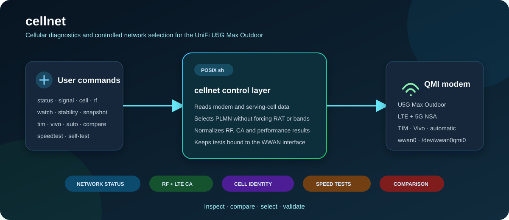

# cellnet

`cellnet` is a diagnostic and network-selection utility for the **Ubiquiti UniFi U5G Max Outdoor**, originally created for multi-network eSIM environments where a single eSIM can register on different mobile operators.



The project was developed using a **Hypecon MVNO eSIM in Brazil**, with access to TIM and Vivo networks. In some Brazilian states and depending on service/network availability, Claro may also be available through the same eSIM.

Because the U5G Max Outdoor UI currently does not expose manual host-network selection, `cellnet` uses the modem's QMI interface to inspect the current network, select a specific PLMN, analyze LTE/5G radio conditions and compare real-world performance.

Current development baseline: **v9.7.0-tower-survey**

> This is an independent project and is not affiliated with or endorsed by Ubiquiti, Hypecon, TIM, Vivo or Claro.

## Project disclaimer

`cellnet` is an early-stage, personal project created to address a specific operational need. Its carrier-selection functionality is currently limited by the test environment: development and hardware validation have been performed with a single multi-network eSIM and the operators available through that subscription.

The project still requires broader testing across additional devices, firmware versions, eSIM/SIM providers, operators, regions and network conditions. Behavior outside the documented environment should not be assumed to be validated or universally compatible.

Development and maintenance are performed in limited personal time, so releases, support and feature coverage may be incomplete or progress slowly. Parts of the implementation and documentation were produced through AI-assisted, exploratory “vibe coding” and subsequently reviewed and tested within the available environment. Users should inspect the code, understand the modem operations involved and validate changes in their own environment before relying on it in production.


## Why cellnet exists

`cellnet` was created from a practical limitation encountered while using a **Ubiquiti UniFi U5G Max Outdoor** with a multi-network eSIM.

The test environment uses an eSIM provided by **Hypecon**, a Brazilian MVNO. The same eSIM can register on more than one underlying mobile network, including **TIM** and **Vivo**. In some Brazilian states, **Claro** may also be available depending on regional and service conditions.

This creates an interesting use case for the U5G Max Outdoor: the same modem and the same eSIM may have access to multiple host networks, each with different radio conditions, cell load, routing, latency and throughput.

At the time this project was created, the U5G Max Outdoor user interface did not provide a way to explicitly choose which available host mobile network should be used.

The modem can select a network automatically, but the automatically selected operator is not necessarily the one providing the best performance at a given location or time.

For example, one operator may provide:

- stronger RSRP but lower throughput;
- better 5G NR SNR but higher latency;
- better LTE Carrier Aggregation but a more congested cell;
- lower signal strength but substantially better real-world throughput.

This is where `cellnet` becomes useful.

Instead of relying only on automatic network selection, `cellnet` exposes modem information already available through QMI and provides a controlled way to:

- inspect the currently registered operator;
- compare TIM and Vivo radio conditions;
- manually select an available PLMN;
- return the modem to automatic network selection;
- inspect LTE and 5G NSA signal quality;
- inspect serving-cell and Carrier Aggregation information;
- compare latency and throughput between operators;
- determine which network is actually performing better at that location.

The goal is **not** to replace UniFi's own management software or modify the modem firmware.

The goal is to expose useful modem capabilities that are not currently available through the UniFi UI and make multi-network eSIM deployments easier to understand and optimize.

### Test environment

The original development and testing environment uses:

```text
Hardware:
  Ubiquiti UniFi U5G Max Outdoor

SIM:
  Hypecon eSIM

eSIM type:
  Multi-network MVNO

Networks observed:
  TIM   - PLMN 72403
  Vivo  - PLMN 72410

Other networks:
  Claro may also be available through the same Hypecon eSIM
  depending on region and service/network availability.

Cellular mode:
  LTE + 5G NSA

Modem management:
  QMI

Cellular interface:
  wwan0

QMI device:
  /dev/wwan0qmi0
```

The important characteristic of this setup is that **carrier choice and SIM choice are not the same thing**.

A single Hypecon eSIM can potentially access multiple host networks. Therefore, replacing the SIM is not required to compare TIM and Vivo: the modem can be instructed to register on a specific available PLMN.

`cellnet` provides a safer and more convenient interface for doing exactly that.

### A practical example

During development, the same U5G Max Outdoor and the same Hypecon eSIM produced very different results depending on the selected host network.

In some tests, TIM presented stronger 5G radio metrics, while Vivo delivered substantially higher throughput and lower latency.

This demonstrated an important point:

> The network with the strongest signal is not necessarily the network with the best performance.

Cell congestion, scheduler behavior, LTE anchor conditions, 5G NR capacity, mobile-core routing and peering can all influence real-world performance.

For that reason, `cellnet` evaluates both **radio conditions** and **actual network performance** instead of making decisions based only on signal strength.

### Multi-network eSIM flow

```text
                         Hypecon eSIM
                              |
               +--------------+--------------+
               |              |              |
              TIM            VIVO          CLARO*
            72403           72410         regional
               |              |
               +-------+------+
                       |
               U5G Max Outdoor
                       |
                      QMI
                       |
                    cellnet
                       |
        +--------------+--------------+
        |              |              |
   RF analysis    PLMN selection   Speed test
```

`*` Claro availability depends on region and MVNO/network conditions.

## Highlights

- TIM / Vivo manual PLMN selection and return to automatic selection.
- LTE / 5G NSA registration and signal diagnostics.
- Serving-cell, PCI, TAC, EARFCN and RF inspection.
- Normalized serving-cell and tower lookup identifiers.
- Read-only RF monitoring and stability summaries without speed tests.
- LTE Carrier Aggregation visibility.
- Diagnostic snapshots and TIM × Vivo comparisons.
- Cellular speed tests forced through `wwan0`.
- Automatic speed-test server selection by default.
- Fixed-server mode for controlled comparisons.
- Warm-up, retry and partial-result handling.
- RF / LTE-CA sampling during throughput tests.
- Separate download/upload RF and CA observations.
- Conservative behavior: normal carrier switching does **not** force LTE/5G RAT modes.

## Important safety rule

Normal carrier switching uses **PLMN only**.

The script deliberately avoids:

```text
5gnr,manual=...
lte,manual=...
```

Those forms can alter persistent RAT/mode preference on the modem.

## Tested environment

```text
Device:             Ubiquiti U5G Max Outdoor
Cellular interface: wwan0
QMI device:         /dev/wwan0qmi0
qmicli:             1.38.x
Firmware family:    UniFi U5G Max Outdoor 7.5.x
Shell:              BusyBox / POSIX sh
```

## Quick installation

```sh
mkdir -p /tmp/log/scripts
cp cellnet /tmp/log/scripts/cellnet
chmod +x /tmp/log/scripts/cellnet
export PATH="$PATH:/tmp/log/scripts"
sh -n /tmp/log/scripts/cellnet
```

Then:

```sh
cellnet status
cellnet rf
cellnet cells
cellnet tower-id
cellnet watch 60
cellnet stability 60
cellnet speedtest
```

## Commands

| Command | Purpose |
|---|---|
| `cellnet tim` | Select TIM PLMN manually |
| `cellnet vivo` | Select Vivo PLMN manually |
| `cellnet auto` | Return to automatic network selection |
| `cellnet status` | Short registration/operator status |
| `cellnet full` | Extended network/signal/RF status |
| `cellnet signal` | LTE/5G signal metrics |
| `cellnet cell` | Serving-cell/channel information |
| `cellnet radio` | LTE/5G NSA/SA information |
| `cellnet rf` | Bands, LTE CA, cell and signal summary |
| `cellnet cells` | Normalized serving-cell, LTE/NR signal and CA summary |
| `cellnet tower-id` | Identifiers for external tower/ERB correlation |
| `cellnet neighbors [raw\|table\|csv\|json]` | Raw or normalized read-only LTE neighbor inventory |
| `cellnet neighbors-csv` | Normalized neighbor observations as CSV |
| `cellnet neighbors-json` | Normalized neighbor observations as JSON |
| `cellnet tower-export [json\|csv]` | Structured serving-cell identifiers |
| `cellnet tower-lookup [lat lon]` | OpenCellID coordinates, distance, bearing and confidence |
| `cellnet observe-cells [seconds]` | Timestamped cell and RF observations as CSV |
| `cellnet survey-report file.csv` | Summarize identity changes and LTE/NR RF metrics from observations |
| `cellnet survey [seconds] [directory]` | Capture serving cell, neighbors, observations and summary together |
| `cellnet survey-compare survey-a survey-b` | Compare identities and RF averages from two survey directories |
| `cellnet tower-assess lat lon [seconds]` | OpenCellID proximity plus RF stability |
| `cellnet tower-assess-speed lat lon [seconds]` | Proximity, stability and throughput; consumes data |
| `cellnet watch [seconds]` | Timestamped read-only RF/cell monitor; default 60 s |
| `cellnet stability [seconds]` | RF ranges and cell-change counters; default 60 s |
| `cellnet preferences` | Current modem system-selection preferences |
| `cellnet scan` | Scan visible operators |
| `cellnet snapshot [name]` | Capture a diagnostic snapshot |
| `cellnet compare` | TIM → Vivo RF comparison |
| `cellnet speedtest [seconds]` | Mobile speed test, automatic server |
| `cellnet speedtest-fixed [seconds]` | Mobile speed test, configured fixed server |
| `cellnet compare-speed [seconds]` | TIM × Vivo performance comparison, automatic servers |
| `cellnet compare-speed-fixed [seconds]` | TIM × Vivo comparison using the same fixed server |

See [Command Reference](docs/COMMANDS.md).

### On-device self-test

The POSIX test harness in `scripts/test-device.sh` targets `/tmp/log/cellnet/cellnet`. Its default mode runs read-only diagnostics, validates exit codes and output markers, and stores individual logs under `/tmp/log/cellnet`. Carrier switching, network scanning and speed tests require explicit flags:

```sh
/tmp/log/cellnet/test-device.sh
/tmp/log/cellnet/test-device.sh --scan
/tmp/log/cellnet/test-device.sh --carrier
/tmp/log/cellnet/test-device.sh --all
```

`--all` changes carriers and runs multiple speed tests, which can interrupt SSH and consume substantial cellular data.

## Speed-test behavior

All throughput tests are bound to:

```text
wwan0
```

and use both directions:

```text
-d both
```

This prevents a test from following a LAN/fixed-broadband default route.

The default:

```sh
cellnet speedtest
```

lets `ui-speed` select a server automatically.

The diagnostic fixed-server mode remains available:

```sh
cellnet speedtest-fixed
```

Current fixed endpoint:

```text
http://103.14.27.177:80
```

## RF sampling

The current baseline samples RF / LTE CA every **3 seconds** during the measured speed test and classifies samples by `ui-speed` phase:

```text
state=3 -> download
state=4 -> upload
```

`UL CA active` refers specifically to LTE Carrier Aggregation SCells; it does not directly indicate NR uplink use.

`watch` and `stability` poll local QMI data every 3 seconds and do not run `ui-speed` or perform Internet lookups. Fields not explicitly exposed by the modem are shown as `n/a`.

`cells` and `tower-id` calculate eNodeB and sector identifiers only when the modem returns a decimal LTE ECI. The calculation uses the common layout `eNodeB = ECI >> 8` and `sector = ECI & 255`; operator implementations may differ. These calculated identifiers are distinct from modem-derived values. An OpenCellID match is an external correlation, not a modem GNSS position. Modem GNSS commands are not implemented in this release.

### Optional OpenCellID lookup

`tower-lookup` sends the current LTE MCC, MNC, TAC and ECI to OpenCellID. It does not upload RF measurements. Supply the API key and the U5G coordinates at runtime; never commit the key:

```sh
export OPENCELLID_API_KEY='your-key'
export CELLNET_LATITUDE='-23.5505'
export CELLNET_LONGITUDE='-46.6333'
cellnet tower-lookup
cellnet tower-assess -23.5505 -46.6333 60
```

OpenCellID coordinates are crowdsourced estimates and may identify a cell coverage centroid rather than the physical mast. Availability and usage are subject to the OpenCellID API policy. When `wget` is used as the HTTP fallback, the key may be temporarily visible to local process inspection; `curl` is preferred.

## Data usage

5G speed tests can consume substantial mobile quota. Prefer `rf`, `signal`, `cell`, `cells`, `watch`, `stability` and `snapshot` for tuning, and use throughput tests only to validate a change.

## Documentation

- [Use Case and Test Environment](docs/USE-CASE-AND-TEST-ENVIRONMENT.md)
- [Installation](docs/INSTALLATION.md)
- [Command Reference](docs/COMMANDS.md)
- [Architecture](docs/ARCHITECTURE.md)
- [RF Metrics](docs/RF-METRICS.md)
- [Speed Testing](docs/SPEEDTEST.md)
- [Troubleshooting](docs/TROUBLESHOOTING.md)
- [Development and Regression Policy](docs/DEVELOPMENT.md)
- [Contributing](CONTRIBUTING.md)
- [Security](SECURITY.md)
- [Changelog](CHANGELOG.md)

## License

This project is licensed under the [MIT License](LICENSE).
