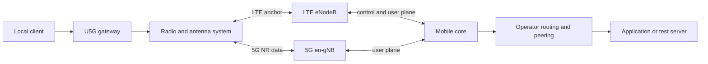
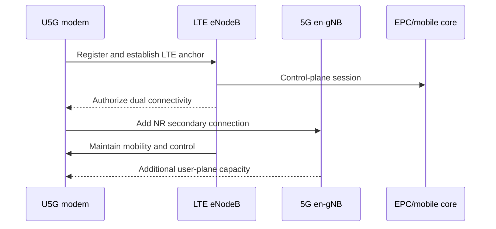
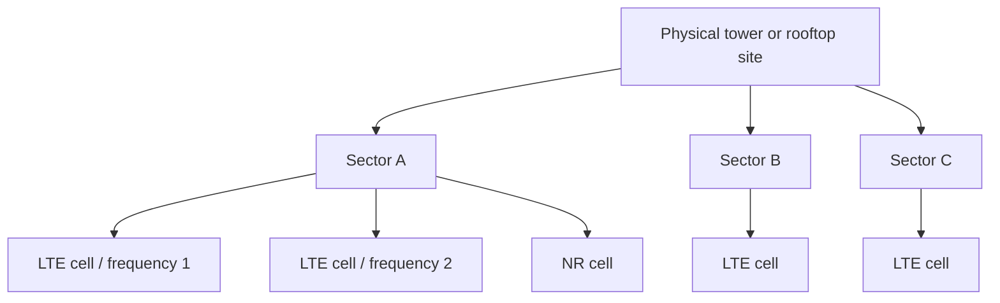
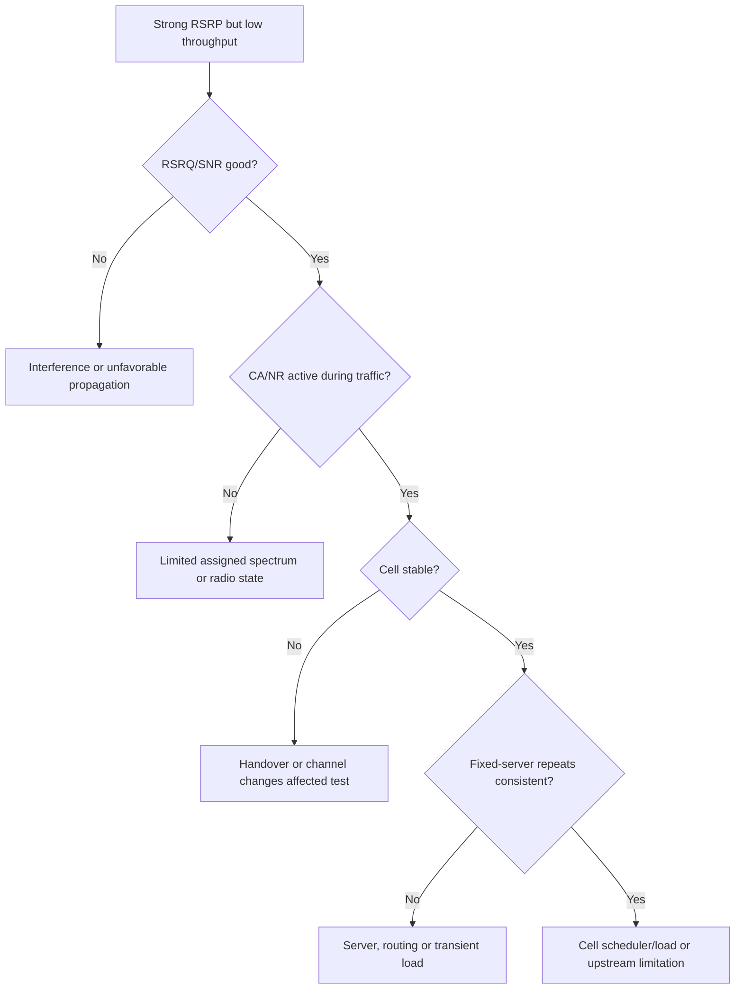
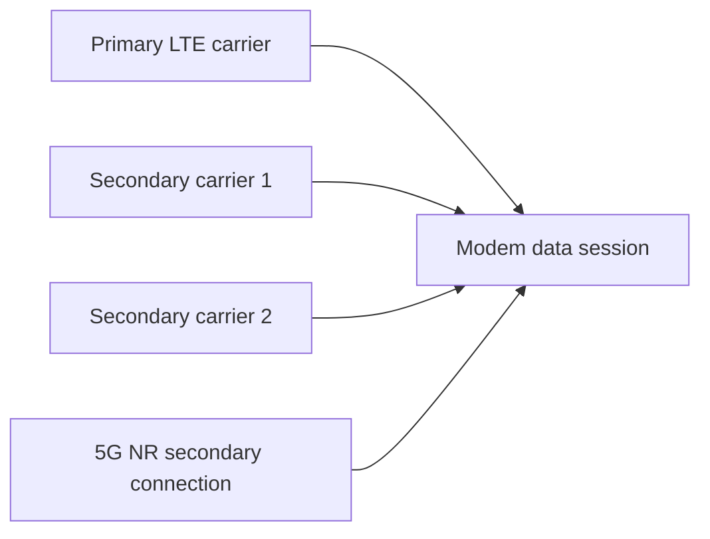
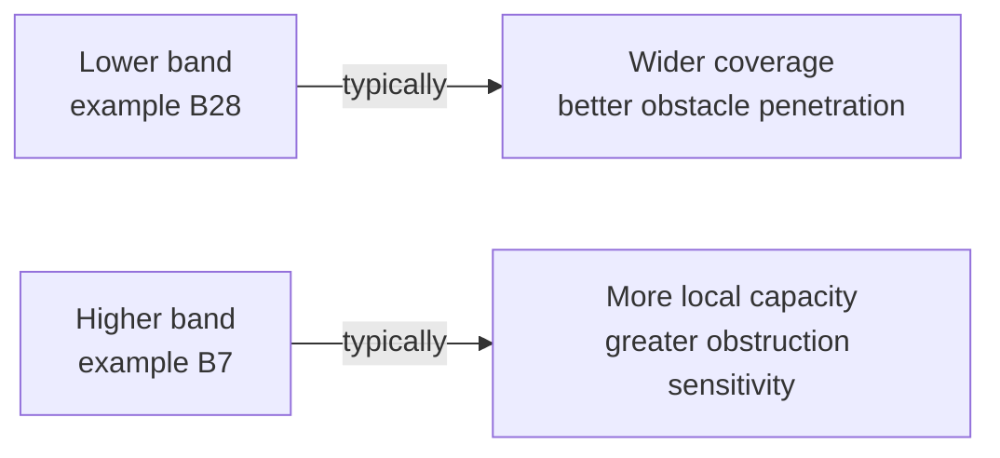
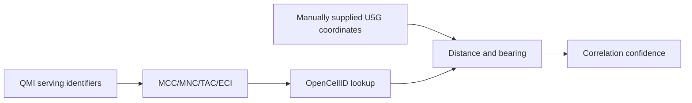

# Cellular Performance and Antenna Location Guide

This guide explains how an outdoor cellular gateway such as the Ubiquiti UniFi U5G Max Outdoor communicates with LTE and 5G networks, which measurements affect real performance, and how to use `cellnet` to compare operators, cells, mounting positions and antenna orientations.

The project was validated primarily with LTE plus 5G Non-Standalone (NSA). Exact modem fields, bands and network behavior depend on firmware, operator configuration, spectrum licenses and local deployment.

## 1. End-to-end communication path



Performance is therefore not determined by signal strength alone. The result can be limited by any of these layers:

1. antenna position, orientation and polarization;
2. radio propagation and interference;
3. LTE anchor and 5G NR availability;
4. assigned bandwidth and Carrier Aggregation;
5. cell load and scheduler decisions;
6. uplink power and link quality;
7. mobile-core routing, roaming and MVNO integration;
8. Internet transit, peering and the destination server.

## 2. LTE and 5G NSA

In 5G NSA, LTE remains the control-plane anchor while NR adds capacity. A strong NR signal does not compensate for an unstable LTE anchor, because registration and much of the connection control still depend on LTE.



Consequences for optimization:

- LTE RSRP, RSRQ and SNR still matter when 5G NSA is active.
- Loss of the LTE anchor may also remove the NR connection.
- NR availability can change with load, scheduling and modem state.
- A 5G indicator alone does not prove that traffic is currently using NR.

The 3GPP multi-connectivity specification describes the LTE/NR master-node and secondary-node relationships used by EN-DC. See [ETSI TS 137 340 V18.5.0 (3GPP TS 37.340)](https://www.etsi.org/deliver/etsi_ts/137300_137399/137340/18.05.00_60/ts_137340v180500p.pdf).

## 3. Cells, sectors and frequencies



A physical site may contain several sectors, cells and frequency layers. Important identifiers include:

| Field | Meaning | Geographic value |
|---|---|---|
| PLMN | Operator identity formed from MCC and MNC | Identifies the network, not the site |
| TAC | Tracking Area Code | Regional grouping, not precise location |
| ECI | LTE cell identity | Useful for external database lookup |
| eNodeB | Commonly calculated from LTE ECI | Often groups related LTE cells, but operator layouts may vary |
| Sector | Low ECI bits in the common layout | May distinguish sectors/carriers, not guaranteed physical azimuth |
| PCI | Physical Cell ID | Locally reusable; not globally unique |
| EARFCN | LTE channel number | Identifies frequency layer and helps interpret PCI |
| NR ARFCN | NR channel number | Identifies NR frequency layer |

Never identify a tower using PCI alone. The same PCI can be reused by many sites. Even `PCI + EARFCN` is a local observation fingerprint, not a globally unique identity.

## 4. Understanding radio measurements

LTE measurement definitions are standardized in 3GPP TS 36.214, published as [ETSI TS 136 214 V18.0.0](https://www.etsi.org/deliver/etsi_ts/136200_136299/136214/18.00.00_60/ts_136214v180000p.pdf). NR measurement definitions are standardized in [ETSI TS 138 215 V18.2.0](https://www.etsi.org/deliver/etsi_ts/138200_138299/138215/18.02.00_60/ts_138215v180200p.pdf).

### RSRP: reference-signal power

RSRP primarily indicates received reference-signal power. It is useful for coverage, but it does not directly measure interference, congestion or throughput.

### RSRQ: reference-signal quality

RSRQ relates reference-signal power to the wider received power. It is sensitive to interference, competing transmissions and load conditions. Strong RSRP with poor RSRQ often indicates that power is available but the radio environment is not clean.

### SNR/SINR: useful signal versus noise and interference

Higher SNR or SINR generally allows more efficient modulation and coding. It often correlates with capacity more strongly than RSRP once coverage is adequate.

### RSSI

RSSI represents wider received power, including useful signal, interference and noise. A high RSSI is not automatically good; it can be elevated by interference.

### Practical interpretation ranges

The following ranges are operational heuristics, not 3GPP performance guarantees. Firmware measurement type, bandwidth, band, load and implementation can change their meaning.

| Metric | Strong/good | Usable | Concerning | Interpretation |
|---|---:|---:|---:|---|
| LTE/NR RSRP | `>= -85 dBm` | `-85 to -100 dBm` | `< -100 dBm` | Coverage/power |
| LTE RSRQ | `>= -10 dB` | `-10 to -15 dB` | `< -15 dB` | LTE quality/interference |
| NR RSRQ | `>= -10 dB` | `-10 to -15 dB` | `< -15 dB` | NR quality/interference |
| SNR/SINR | `>= 15 dB` | `5 to 15 dB` | `< 5 dB` | Signal usability/capacity |

Treat trends and repeated tests as more meaningful than a single threshold crossing.

## 5. Why stronger signal may be slower



Common reasons include:

- the stronger cell is more congested;
- the weaker cell has more bandwidth or better CA;
- SNR is poor despite strong RSRP;
- the LTE anchor is strong but NR is weak or inactive;
- the modem is assigned fewer resource blocks;
- uplink conditions are poor;
- the speed-test route or server is limiting the result;
- the multi-network eSIM follows different core and roaming paths.

## 6. Carrier Aggregation

Carrier Aggregation combines a primary component carrier with one or more secondary carriers.



Important distinctions:

- configured or observed SCells may be deactivated while traffic is idle;
- CA should be sampled during download/upload;
- more carriers do not guarantee proportional throughput;
- carrier bandwidth, modulation, MIMO, scheduler allocation and cell load matter;
- LTE CA information does not by itself prove NR traffic usage.

Use:

```sh
cellnet rf
cellnet speedtest 15
cellnet compare-speed-fixed 15
```

## 7. Bands and propagation

Lower frequencies generally travel farther and penetrate obstacles better. Higher frequencies generally offer more reusable spectrum and capacity but experience greater path loss and obstruction sensitivity.



This is a tendency, not a ranking rule. A loaded B28 cell can be slower than a clean B7 cell, and a well-engineered higher-band link can outperform a stronger low-band link.

## 8. Physical installation and orientation

For an outdoor gateway:

1. prefer a clear path toward the serving area;
2. avoid mounting immediately behind metal, reinforced concrete, solar panels or dense equipment;
3. test height instead of assuming the highest point is best;
4. keep distance from strong local RF noise sources;
5. rotate or reposition in controlled increments;
6. wait for registration and NSA/CA stabilization after each change;
7. compare repeated fixed-server results at similar times;
8. record weather and network-load context when relevant.

Reflections can make a non-line-of-sight orientation outperform the apparent tower direction. Optimization must therefore be measurement-led.

## 9. Geographic tower correlation



`cellnet tower-lookup` uses the serving LTE identity. OpenCellID coordinates are crowdsourced and may represent an estimated coverage centroid rather than the physical mast.

Neighbor output usually provides PCI and EARFCN but not ECI. Consequently, neighbors cannot normally be geolocated reliably through OpenCellID from the available QMI response.

Distance and bearing are useful for orientation hypotheses, but performance should still be validated through RF stability and throughput.

## 10. Recommended optimization workflow

### Establish a baseline

```sh
cellnet status
cellnet cells
cellnet neighbors table
cellnet survey 300
```

Record the generated survey directory.

### Change one variable

Change only one of:

- orientation;
- height;
- mounting position;
- operator;
- test time.

Then repeat:

```sh
cellnet survey 300
```

### Compare like with like

```sh
cellnet survey-compare /path/to/survey-a /path/to/survey-b
```

A direct RF comparison is strongest when PLMN, ECI and LTE EARFCN match. Cross-operator or cross-cell comparisons remain useful, but their RF deltas are contextual.

### Validate performance

```sh
cellnet speedtest-fixed 15
```

Repeat at least three times and prefer the median result. Use automatic-server tests to represent user experience, but fixed-server tests for controlled A/B comparisons.

### Compare operators

```sh
cellnet compare-speed-fixed 15
```

This changes PLMN and consumes cellular data. Confirm automatic selection afterwards when appropriate:

```sh
cellnet auto
```

## 11. What to optimize first

| Observation | First action |
|---|---|
| Weak RSRP and weak SNR | Improve position, height or orientation |
| Strong RSRP and poor RSRQ/SNR | Search for a cleaner orientation/cell; investigate interference/load |
| Stable RF but inconsistent throughput | Repeat fixed-server tests; consider scheduler/load/routing |
| Good LTE but weak NR | Optimize for NR without sacrificing LTE anchor stability |
| CA rarely active during traffic | Compare bands/operators and confirm sampling during download |
| Frequent ECI/PCI/EARFCN changes | Seek a more stable position before ranking throughput |
| Better RF but worse throughput | Prefer measured performance; investigate load, CA and routing |
| OpenCellID cell missing | Continue RF/performance testing; database absence is not a radio fault |

## 12. Interpreting the current `cellnet` reports

### `cells`

Use for a normalized instantaneous view of the serving LTE/NR condition.

### `neighbors`

Use to understand locally visible PCI/frequency layers. Do not treat neighbor PCI as a selectable or geographically unique tower.

### `watch`

Use to observe live changes while adjusting the installation.

### `stability`

Use for a short, low-data assessment before running throughput tests.

### `survey`

Use as the primary evidence package for a mounting position or operator.

### `speedtest-fixed`

Use for controlled performance comparison. It consumes cellular data.

## 13. Limitations and safety

- `cellnet` does not force RAT or LTE/NR bands during normal carrier selection.
- It does not lock the modem to a specific physical tower.
- PCI and EARFCN cannot uniquely identify a site globally.
- Calculated eNodeB/sector values depend on the common ECI layout and may vary by operator implementation.
- OpenCellID coverage and accuracy are external limitations.
- RF metrics do not measure cell load directly.
- Speed tests consume data and can be influenced by servers and routing.
- `/tmp` survey data is volatile and may disappear after reboot.

## 14. Compact checklist

```text
[ ] Same operator and cell for direct orientation comparison
[ ] Same test duration and polling interval
[ ] Fixed server for controlled throughput comparison
[ ] At least three throughput repetitions
[ ] LTE anchor stable
[ ] NR observed during the test
[ ] RSRQ and SNR considered, not only RSRP
[ ] CA sampled during traffic
[ ] No unexplained cell/channel changes
[ ] OpenCellID treated as approximate correlation
[ ] Automatic carrier selection restored when required
```

## 15. References

- [ETSI TS 137 340 V18.5.0 — LTE/NR multi-connectivity (3GPP TS 37.340)](https://www.etsi.org/deliver/etsi_ts/137300_137399/137340/18.05.00_60/ts_137340v180500p.pdf)
- [ETSI TS 136 214 V18.0.0 — E-UTRA physical-layer measurements](https://www.etsi.org/deliver/etsi_ts/136200_136299/136214/18.00.00_60/ts_136214v180000p.pdf)
- [ETSI TS 138 215 V18.2.0 — NR physical-layer measurements](https://www.etsi.org/deliver/etsi_ts/138200_138299/138215/18.02.00_60/ts_138215v180200p.pdf)
- [Official libqmi documentation and API reference index](https://mobile-broadband.pages.freedesktop.org/docs/libqmi/api-reference/)

The ETSI links above intentionally target specific published PDF versions so the cited clauses do not silently change. The libqmi link targets its maintained API index, which provides links to the current and archived versioned references.
